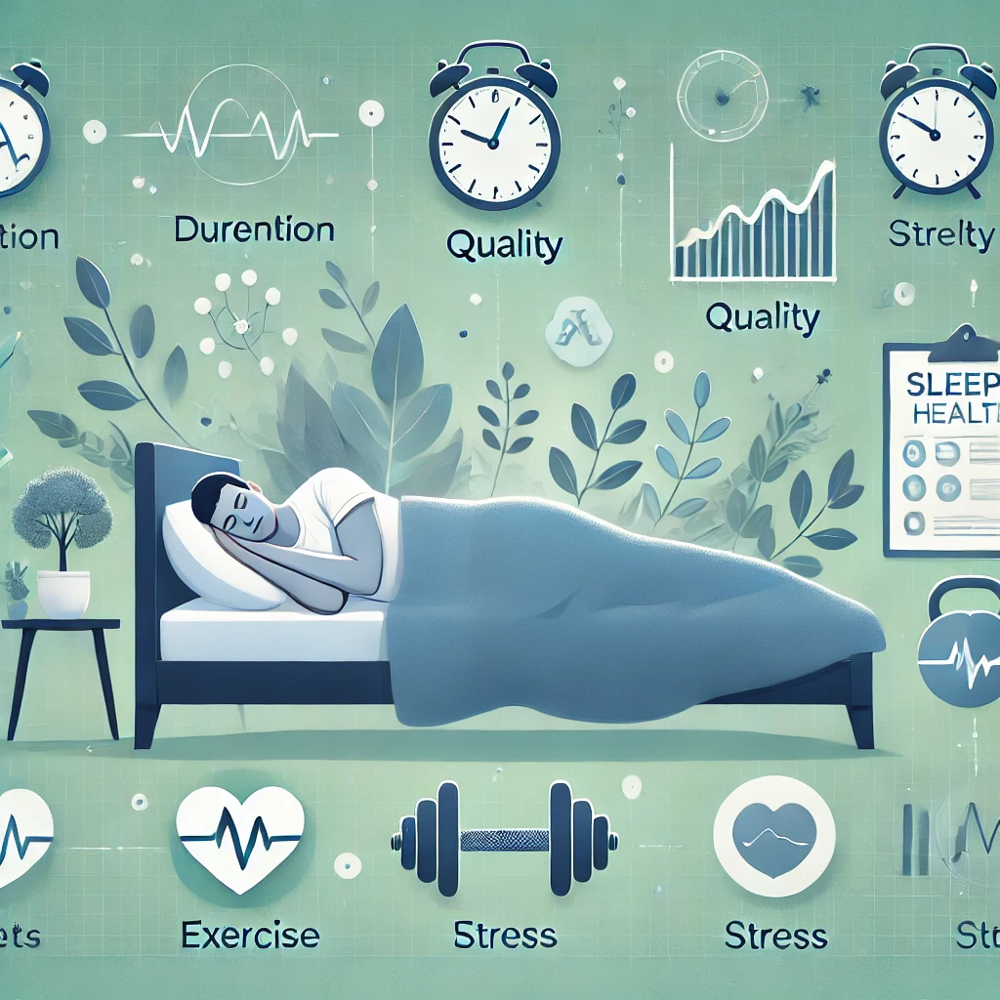
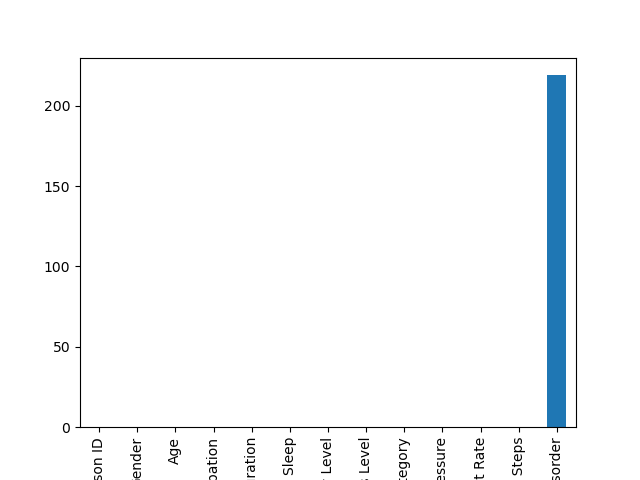
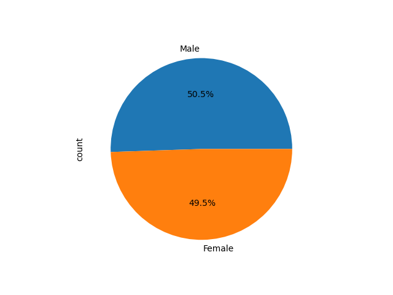
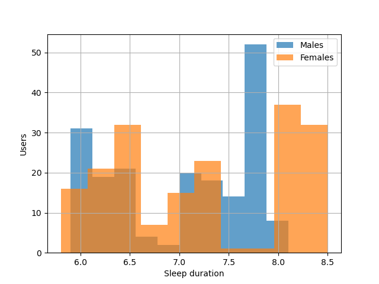
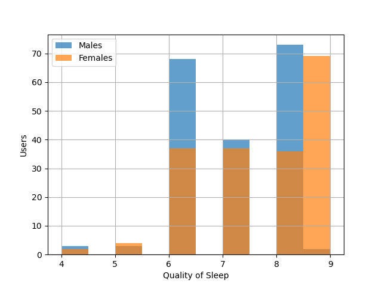
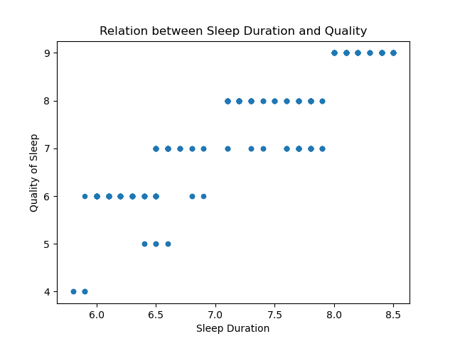

# Acerca de este proyecto

Este proyecto forma parte de mi portafolio personal y se ha realizado con fines educativos. Los datos de este proyecto son propiedad de [DataCamp](https://www.datacamp.com/portfolio/cesarnavarro94) y se han obtenido de uno de sus cursos de ciencia de datos. La imagen insomnia.jpg ha sido generada por IA.

## El cliente

SleepInc ha compartido datos de sueño anonimizados de su nueva y popular aplicación de seguimiento del sueño, SleepScope. Como su consultor de ciencia de datos, han solicitado un análisis de los datos de la encuesta de estilo de vida para descubrir relaciones entre el ejercicio, el género, la ocupación, ... y la calidad del sueño.

## 💾 Los datos: sleep_health_data.csv

SleepInc nos ha proporcionado un conjunto de datos que contiene métricas sobre la calidad del sueño y el estilo de vida de 374 individuos. El conjunto de datos incluye valores promedio durante los últimos 6 meses.

El conjunto de datos incluye 13 columnas que abarcan la duración del sueño, la calidad, los trastornos del sueño, el ejercicio, el estrés, la dieta y otros datos demográficos útiles para el análisis.

| Columna                                   | Descripción                                                                                                          |
| ----------------------------------------- | -------------------------------------------------------------------------------------------------------------------- |
| `ID de persona`                           | Un identificador para cada individuo.                                                                                |
| `Género`                                  | El género de la persona (Masculino/Femenino).                                                                        |
| `Edad`                                    | La edad de la persona en años.                                                                                       |
| `Ocupación`                               | La ocupación o profesión de la persona.                                                                              |
| `Duración del sueño (horas)`              | El número promedio de horas que la persona duerme por día.                                                           |
| `Calidad del sueño (escala: 1-10)`        | Una calificación subjetiva de la calidad del sueño, que va de 1 a 10.                                                |
| `Nivel de actividad física (minutos/día)` | El número promedio de minutos que la persona dedica a la actividad física diariamente.                               |
| `Nivel de estrés (escala: 1-10)`          | Una calificación subjetiva del nivel de estrés experimentado por la persona, que va de 1 a 10.                       |
| `Categoría de IMC`                        | La categoría de IMC de la persona (por ejemplo, Bajo peso, Normal, Sobrepeso).                                       |
| `Presión arterial (sistólica/diastólica)` | La medición promedio de la presión arterial de la persona, indicada como presión sistólica sobre presión diastólica. |
| `Ritmo cardíaco (ppm)`                    | El ritmo cardíaco promedio en reposo de la persona en pulsaciones por minuto.                                        |
| `Pasos diarios`                           | El número promedio de pasos que la persona da por día.                                                               |
| `Trastorno del sueño`                     | La presencia o ausencia de un trastorno del sueño en la persona (Ninguno, Insomnio, Apnea del sueño).                |

# Metodología

## Verificación de datos

He verificado los valores faltantes en el dataframe, la única columna que parece tener valores `NaN` es Trastorno del sueño

Esto se debe a que ninguno de estos usuarios ha informado algún trastorno del sueño. He llenado esos valores faltantes con "Ninguno" para poder realizar cálculos con estos valores.

## Descripcion de los datos

### Género

Podemos obsrvar una distribución homogenea del género en la muestra

#### Duracion del sueño por género

En cuanto a la duración del sueño, podemos observar que las mujeres tienden a tener una pico al rededor de 8 horas de suño, miestras que los hombres muestran un pico al rededor de las 7,5 horas de sueño.

Sin embargo ambos grupos muestran una variabilidad del sueño entre 6 y 8.5 horas

#### Calidad del sueño por género

Sobre la calidad del sueño entre hombres y mujeres podemos concluir que ambos grupos reposrtan niveles altos de calidad del sueño, siendo las mujeres quienes reportan mejor calidad del sueño, especialmente en los niveles más altos.

## Relación entre la duración del sueño y la calidad

Podemos observar una relacion positiva y fuerte entre la duracion del sueño y la calidad del mismo, alcanzando las mayores puntuaciones de calidad cuando la duración está por encima de las 7,5 horas de sueño.

