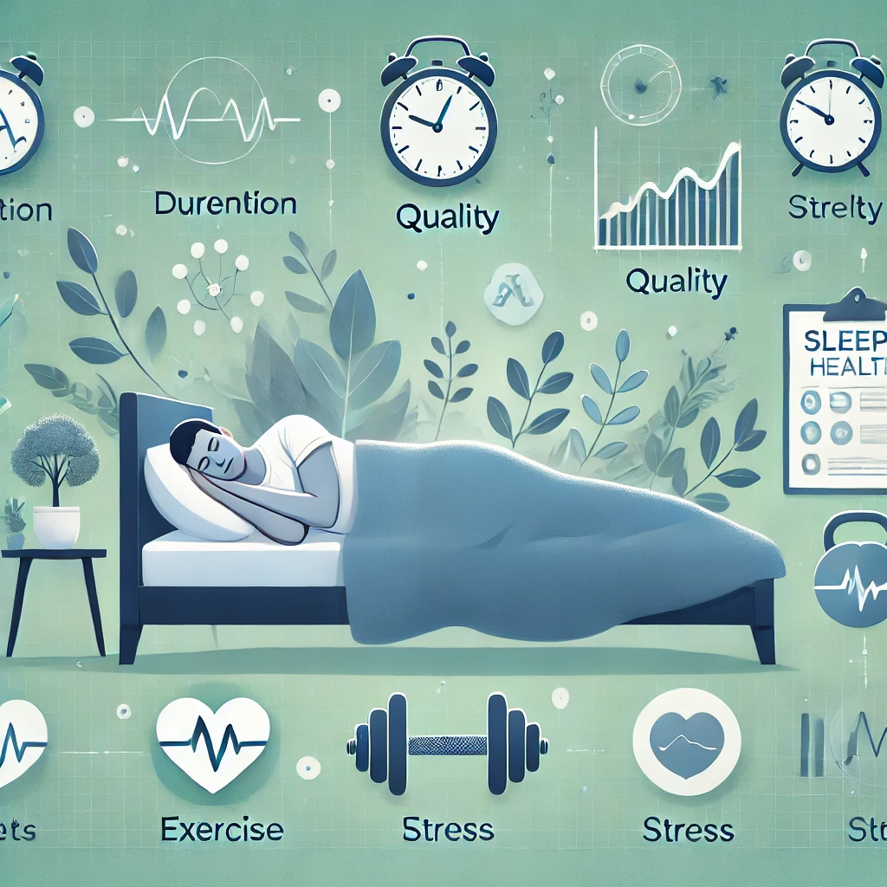

# About this project

This project is part of my personal portfolio and has been conducted for educational purposes. The data about this project are the property of [DataCamp](https://www.datacamp.com/portfolio/cesarnavarro94) and have been taken from one of their data science courses. The insomnia.jpg imagen has been generated by IA

## The Client

SleepInc has shared anonymized sleep data from its new and popular sleep tracking app, SleepScope. As their data science consultant, they have requested an analysis of the lifestyle survey data to uncover relationships between exercise, gender, occupation, and sleep quality.

## 💾 The Data: sleep_health_data.csv

SleepInc has provided us with a dataset containing metrics on sleep quality and lifestyle from 374 individuals. The dataset includes average values over the last 6 months.

The dataset includes 13 columns, encompassing sleep duration, quality, sleep disorders, exercise, stress, diet, and other demographic data useful for analysis.

| Column                                  | Description                                                                                                   |
| --------------------------------------- | ------------------------------------------------------------------------------------------------------------- |
| `Person ID`                             | An identifier for each individual.                                                                            |
| `Gender`                                | The gender of the person (Male/Female).                                                                       |
| `Age`                                   | The age of the person in years.                                                                               |
| `Occupation`                            | The occupation or profession of the person.                                                                   |
| `Sleep Duration (hours)`                | The average number of hours the person sleeps per day.                                                        |
| `Quality of Sleep (scale: 1-10)`        | A subjective rating of the quality of sleep, ranging from 1 to 10.                                            |
| `Physical Activity Level (minutes/day)` | The average number of minutes the person engages in physical activity daily.                                  |
| `Stress Level (scale: 1-10)`            | A subjective rating of the stress level experienced by the person, ranging from 1 to 10.                      |
| `BMI Category`                          | The BMI category of the person (e.g., Underweight, Normal, Overweight).                                       |
| `Blood Pressure (systolic/diastolic)`   | The average blood pressure measurement of the person, indicated as systolic pressure over diastolic pressure. |
| `Heart Rate (bpm)`                      | The average resting heart rate of the person in beats per minute.                                             |
| `Daily Steps`                           | The average number of steps the person takes per day.                                                         |
| `Sleep Disorder`                        | The presence or absence of a sleep disorder in the person (None, Insomnia, Sleep Apnea).                      |
